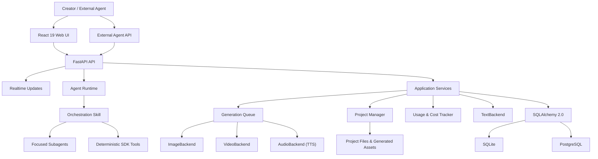
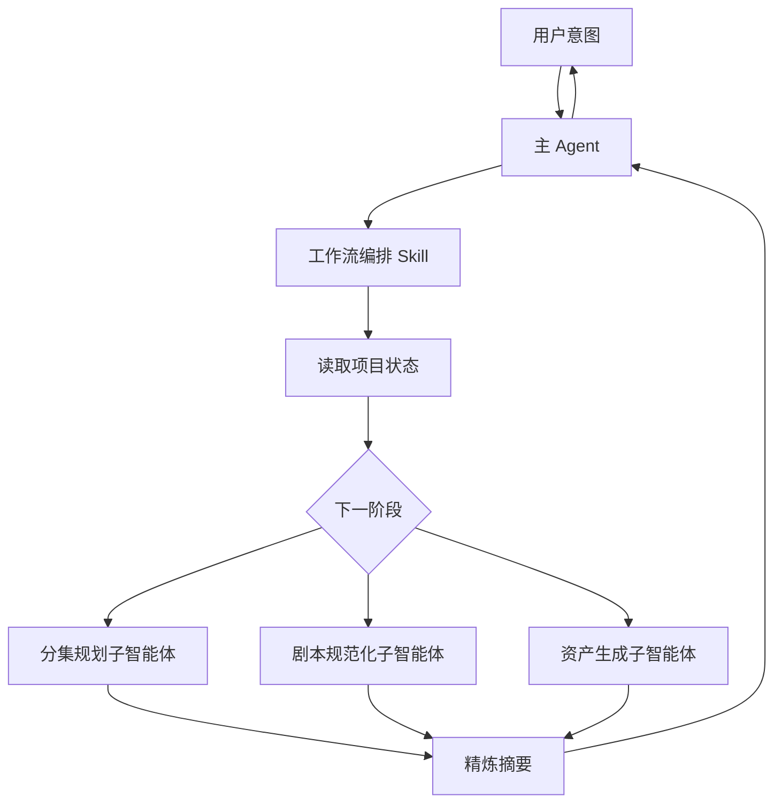
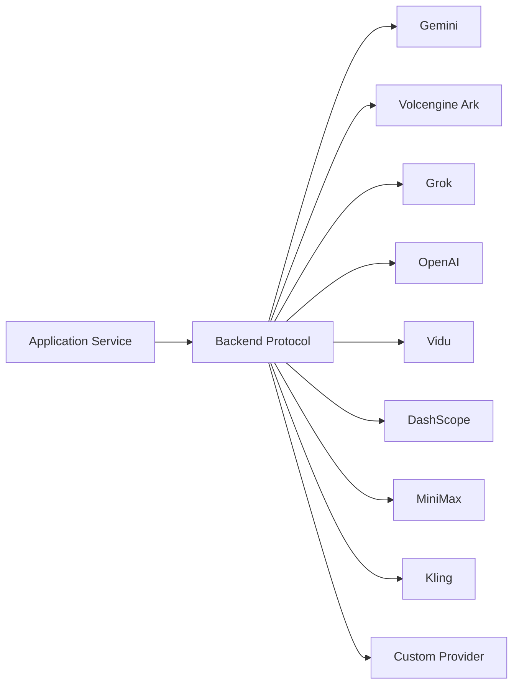

# 架构说明 {#architecture}

本文档描述 ArcReel 的稳定架构边界、主要数据流和扩展点。它不替代代码级 API 文档，也不记录临时实现计划。

## 1. 架构目标 {#goals}

ArcReel 的核心目标不是绑定某个模型，而是提供一条：

- 可编排；
- 可审核；
- 可中断恢复；
- 可替换供应商；
- 可追踪成本；
- 可保留版本；
- 可继续后期编辑

的 AI 视频生产流水线。

## 2. 总体架构 {#overview}



## 3. 前端层 {#frontend-layer}

前端使用 React 19 和 TypeScript，主要职责包括：

- 项目列表和创建；
- 项目工作台；
- 素材预览；
- Agent（智能体）对话；
- 任务状态；
- 费用统计；
- 设置和供应商管理；
- 版本历史；
- 项目导入和导出。

前端不应直接处理供应商密钥或绕过后端调用模型。

## 4. API 与实时状态 {#api-and-realtime}

FastAPI 提供：

- REST API；
- 认证；
- 项目和资产操作；
- 任务创建与查询；
- Agent 对话；
- Agent 与项目事件 SSE；
- 生成任务查询；
- 外部 API Key 接入。

Agent 回复通过对话 SSE 流式返回；项目终态变化通过项目事件 SSE 触发界面刷新，生成任务的中间状态和断线兜底由任务查询补充。部署反向代理时必须关闭 SSE 代理缓冲并设置足够长的读取超时。

## 5. Agent Runtime {#agent-runtime}

Agent Runtime 基于 Claude Agent SDK，并采用“编排 Skill + 聚焦子智能体”的结构。



### 5.1 编排 Skill {#orchestration-skills}

负责：

- 判断项目当前状态；
- 选择下一步；
- 调用确定性工具；
- 分发子智能体；
- 控制阶段边界；
- 在需要时等待用户确认。

编排层不应承担所有内容推理，否则会让主上下文快速膨胀。

### 5.2 聚焦子智能体 {#focused-subagents}

每个子智能体聚焦一个目标，例如：

- 旁白/解说片段拆分；
- 剧情演绎剧本规范化；
- 参考生视频单元拆分；
- 单集结构化剧本；
- 资产生成；
- 审片。

其中前三项是脚本规划，规划时同时识别本集新增资产。

大量小说原文和中间推理尽量保留在子智能体内部，主 Agent 接收摘要和结果引用。

子智能体 `.md` 中的速查或浓缩清单不得省略规则的例外分支；无法完整保留时只引用规则的真相源，不复述规则。

### 5.3 确定性工具 {#deterministic-tools}

确定性操作更适合由工具或 Skill 执行，例如：

- 读取和写入项目文件；
- 创建任务；
- 查询状态；
- 生成结构化文件；
- 合成视频；
- 导出归档。

这类操作不应反复交给语言模型自由生成。

## 6. 应用服务层 {#service-layer}

应用服务协调：

- 项目；
- 剧集；
- 角色、场景和道具；
- 分镜；
- 媒体任务；
- 文件上传；
- 项目导入和导出；
- 剪映草稿；
- 费用和用量；
- 诊断信息。

服务层应依赖稳定协议，而不是直接向上层泄漏供应商 SDK 的具体对象。

### 6.1 核心库与服务端的分界 {#core-server-boundary}

后端由核心库 `lib/` 与服务端 `server/` 两个包组成，依赖只能由服务端指向核心库。

- **核心库**是领域逻辑与基础设施：项目与资产、脚本与分镜、生成队列、供应商调用、计费、数据库访问等。它不知道 HTTP、Agent SDK、SSE 等交付方式的存在。
- **服务端**是交付层（HTTP 路由、Agent 工具、MCP）加上多个入口共用的用例编排，后者即应用服务（`server/services/`）。
- 归属的判据是「模块是什么」，不是「谁在用它」：只被服务端使用的领域模块仍属核心库；不依赖服务端的纯领域服务应移入核心库。
- 路由层可以直接调用核心库，不强制经过应用服务。应用服务只在两种情况下需要：同一用例被多个入口共用；需要跨多个领域包协调事务或补偿。
- 与 Web 框架绑定的胶水归服务端。例如文案表与按语言成文在 `lib/i18n/`，从请求的 `Accept-Language` 解析语言、向路由注入 translator 的依赖在 `server/i18n.py`。

这条分界由依赖检查强制（import-linter，契约写在 `pyproject.toml`）：「核心库不依赖服务端」与「核心库不依赖 HTTP 框架」（fastapi / starlette）。两条契约都没有豁免。核心库需要服务端的能力时由应用装配处注入，例如生成 Worker 的任务执行器与续跑执行器由 `server/app.py` 构造 Worker 时传入。

## 7. 供应商抽象 {#provider-abstraction}

ArcReel 使用：

- `TextBackend`
- `ImageBackend`
- `VideoBackend`
- `AudioBackend`

统一不同供应商的调用方式。



抽象层负责统一：

- 请求输入；
- 任务创建；
- 任务轮询；
- 输出位置；
- 统一错误；
- 用量信息；
- 费用计算入口。

供应商差异仍然存在，例如：

- 参数；
- 时长；
- 参考图数量；
- 异步任务状态；
- 失败语义；
- 计费单位。

正确做法是把这些差异封装在后端适配器和能力描述中，而不是假装所有供应商完全相同。

## 8. 生成任务队列 {#generation-queue}

图像、视频和音频任务具有不同的成本和延迟特征，因此使用独立并发通道。

主要能力：

- 异步执行；
- Image / Video / Audio 独立并发；
- 状态持久化；
- 中断恢复；
- 失败记录；
- 排队中任务的取消；
- 项目事件通知与任务状态刷新。

### 8.1 为什么需要持久化任务 {#why-persistent-tasks}

模型调用可能持续数分钟。任务不能只存在于内存，否则进程重启会丢失：

- 已提交的远程任务 ID；
- 当前状态；
- 费用；
- 输出路径；
- 错误信息。

### 8.2 幂等性 {#idempotency}

创建和重试任务时应避免：

- 同一个分镜重复扣费；
- 远程任务已成功但本地重复提交；
- SSE 断开导致任务被认为失败；
- 重复点击产生相同的生成任务。

任务身份、持久化状态和供应商任务 ID 是处理这些问题的关键。

## 9. 项目和资产模型 {#project-and-asset-model}

ArcReel 的项目不仅是一条数据库记录，还包括文件系统中的媒体资产。

典型内容：

- 原始小说、剧本或商品素材；
- 项目配置；
- 角色、场景和道具定义；
- 参考图；
- 分镜；
- 视频片段；
- 音频；
- 合成输出；
- 历史版本；
- 导出归档。

应用数据根目录解析顺序：

1. `ARCREEL_DATA_DIR`
2. 兼容变量 `AI_ANIME_PROJECTS`
3. 默认 `<仓库根>/projects/`

数据根下的布局（[ADR 0088](https://github.com/ArcReel/ArcReel/blob/main/docs/adr/0088-data-root-layered-projects-subdirectory.md)）：

```text
<数据根>/
├── projects/<项目名>/         项目与生成资产
├── global_assets/             全局资产库
├── users/<user_id>/memory/    Agent 用户记忆
├── arcreel.db                 默认 SQLite 数据库
├── logs/                      文件日志
├── vertex_keys/               Vertex 凭据
├── trial_runs/                端点「测试连接」的产物
└── runtime/                   生成准入锁、迁移完成标记、迁移错误日志
```

- 各条目的位置只由 `lib/infra/data_root_layout.py` 的 `DataRootLayout` 给出，其它代码不自行拼接，也不从项目目录反推数据根。
- 「什么是项目」只由 `is_project_dir` 回答：`projects/` 下名字符合项目名规则、并且带 `project.json` 的目录。数据根里的其它条目一概不是项目，新增系统目录不需要前缀或登记清单。
- Agent 读访问对数据根默认拒绝，只放行当前项目和当前用户的记忆。
- 代码目录只放代码与配置，运行时不向其中写数据。
- 从旧布局升级时，启动阶段的数据根布局迁移（`lib/infra/data_root_layout_migration.py`）把条目搬到上述位置，完成后写入 `runtime/` 下的完成标记。

## 10. 数据库 {#database}

ArcReel 使用 SQLAlchemy 2.0 异步 ORM。

### SQLite {#database-sqlite}

适合：

- 个人体验；
- 本地开发；
- 轻量单实例。

默认使用 WAL、忙等待超时和外键约束。

### PostgreSQL {#database-postgresql}

适合：

- 生产环境；
- 较高并发；
- 长期运行；
- 更成熟的备份和恢复。

应用启动时运行 Alembic 迁移，将数据库升级到当前版本。

## 11. 版本历史 {#version-history}

媒体生成具有不确定性，因此“重新生成”不应简单覆盖旧文件。

版本历史用于：

- 对比不同生成结果；
- 回滚；
- 保留已审核版本；
- 降低试错风险；
- 为项目归档提供完整上下文。

服务层应通过统一的资产版本接口操作，而不是让各供应商适配器自行决定如何覆盖文件。

## 12. 用量和费用 {#usage-and-cost}

用量追踪跨越：

- 文本；
- 图片；
- 视频；
- TTS；
- 不同供应商；
- 不同币种；
- 预估和实际。

设计原则：

- 供应商适配器提供原始用量；
- 费用策略负责转换；
- 不同币种默认分开统计；
- 失败任务是否计费按供应商语义处理；
- ArcReel 记录不替代供应商官方账单。

## 13. 视频合成与剪映导出 {#video-composition-and-export}

媒体生成完成后有两种输出路径。

### 剪辑时间线 {#edit-timelines}

剪辑时间线是一集的一套具名剪辑决策，可以有多条，存放在项目目录的 `edit_timelines/episode_{N}/{timeline_id}.json`。每份文件保存稳定 ID、显示名、片段编号分配器与不可变修订序列；修订记作者、摘要、父修订和 Agent 轮次。它是正式内容，随项目归档导出和导入，不进入产物清单。

`lib/edit_timeline/` 统一负责新建、列表、读取、批量编辑和下述管理操作。HTTP 入口为 `POST /api/v1/projects/{project_name}/episodes/{episode}/edit-timelines`、`GET /api/v1/projects/{project_name}/edit-timelines` 与 `GET /api/v1/projects/{project_name}/edit-timelines/{timeline_id}`；Agent 工具 `create_timeline`、`list_timelines`、`read_timeline` 调用同一服务。集内写入持文件锁并原子落盘，Agent 禁止直接改写该目录。

批量编辑由 Agent 工具 `edit_timeline` 调用服务的 `edit` 命令。服务在集内文件锁下读取最新修订，校验 `base_revision` 后整批应用按片段 ID 定位的操作，只追加一个修订。

管理操作由同一服务提供，Agent 工具与 HTTP 入口共用：

- **复制**：Agent 工具 `create_timeline`（`from: "timeline"`）与 `POST …/edit-timelines/{timeline_id}/copy`。把指定修订（缺省为最新修订）的内容原样复制成同一集的新剪辑时间线，片段编号与编号分配器一并带过去，新时间线从修订 1 起。
- **改名**：`rename_timeline` 与 `PATCH …/edit-timelines/{timeline_id}`。只改文档头的显示名，不产生修订，成片与剪映草稿也不因此过期。
- **修订历史**：`list_revisions` 与 `GET …/edit-timelines/{timeline_id}/revisions`。
- **回滚**：`restore_revision` 与 `POST …/edit-timelines/{timeline_id}/restore`。以旧修订的内容追加新修订，`restored_from` 记录来源，历史不改写。回滚总是作用在最新修订上，不做乐观并发判定；改动记录取与最新修订之间的差异，相对顺序变化时两份内容共有的片段都计入，让基于旧修订的编辑宁可多报冲突。目标内容与最新修订相同时返回 `revision_unchanged`。
- **删除**：只有 `DELETE …/edit-timelines/{timeline_id}`，不向 Agent 开放。时间线 ID 随机生成、不复用，成片与剪映草稿的产物身份挂在 ID 上，因此删除时同时清除这条时间线的成片与剪映草稿登记，并删除 `renders/episode_{N}/{timeline_id}/` 目录。当前用户提交的、以该时间线为对象的渲染任务仍在排队或执行时，端点以 `edit_timeline_render_in_progress` 拒绝。

每个修订记录实际改动过的片段 ID。`base_revision` 落后时，服务累计期间每个修订的改动记录，并检查本批在基准修订和最新修订上的连带修改。涉及的片段都未被改过，且本批设置转场的片段在两个修订上接着同一个片段时，操作应用到最新修订；否则以 `revision_conflict` 拒绝。旧修订缺少改动记录时，由逐修订内容差异推断。

插入、删除、移动改变相邻关系时，受影响的切点恢复硬切。同一视频单元最多一个片段承载旁白，片段编号不复用。

片段引用视频单元的 current 视频，不随脚本增删自动更新。内部时间为整数微秒，读取时探测实际媒体时长并投影为最多三位小数的秒，返回片段绝对起点、旁白起止与结构问题。截取保存依据版本，换版本后按完整视频计算时长；原声默认音量按发声归属取值。转场、定格延长与 BGM 决策保存在修订内容中，字幕文字与旁白交付版本不写入剪辑时间线。

旁白从承载片段的起点开始，按配音实测时长播放，可以延伸到后续片段上；`place_narration` 操作把旁白改挂到同一视频单元的另一个片段。TTS 配音项目的读取结果另报三类旁白问题，后期配音项目不报：缺少旁白配音（`narration_missing`，只阻断带旁白版本）；旁白越界（`narration_overrun`，与下一段旁白重叠或超出时间线末尾，警告，只影响带旁白版本）；可能与原声相撞（`narration_source_collision`，旁白延伸到台词片段或原声音量高于 0.3 的片段上，警告）。另有字幕缺字（`subtitle_missing_glyphs`，警告），按随包字幕字体的字符表检查所用视频单元的字幕文字，列出字体里没有的字符，不分项目的旁白交付方式。呈现模型允许旁白配音比视频长，字幕按旁白时长分布，所以这类视频单元的剪映草稿导出、预览素材层、单元预览与单元素材包照常进行。

BGM 片段（编号 `b1`、`b2`……，与视频片段的编号分开分配）由 `insert_bgm`、`set_bgm`、`delete_bgm` 操作增删改，按时间线上的绝对起点摆放，主轨的增删移动不挪动它们；每段记录所引用的 BGM、截取区间、音量（默认 0.25）与淡入淡出（默认各 1 秒）。本批改动的 BGM 片段起点须落在时间线内，且不与其他 BGM 片段重叠。`lib/edit_timeline/bgm.py` 的摆放供读取、成片与剪映草稿共用：超出时间线末尾的部分截断，截断处固定淡出 1 秒；淡入淡出之和超过片段时长时缩短。读取结果按摆放给出每段的实际结束时间与生效的淡入淡出；引用的 BGM 已不在项目里时报 `bgm_missing`（阻断）。BGM 片段参与乐观并发判定，与视频片段一样按片段 ID 记录改动。

剪辑视图的预览在浏览器里按读取结果实时拼接，不经服务端渲染。旁白配音、字幕与 BGM 文件由 `GET /api/v1/projects/{project_name}/edit-timelines/{timeline_id}/preview-media` 提供：按最新修订列出引用的视频单元与 BGM（BGM 带文件路径与响度增益），旁白版本取项目默认值（TTS 配音项目带旁白），字幕取自各单元当前的呈现模型，与剪映草稿是同一份切分结果，时间相对单元。前端按剪辑片段把字幕摆到全局时间，摆放规则与剪映草稿相同。播放时，全局时钟在画面部分跟随视频；任一段媒体缓冲卡住，时钟与全部媒体一起暂停。旁白与 BGM 按全局时钟对齐：偏差小时微调播放速度，偏差大时直接跳转。视频单元的原声按「片段音量 × 生成时的供应商原声开关」播放，开关取自 current 视频的版本记录，口径与成片一致；`preview-media` 按单元返回 `provider_audio`，生成时关闭原声的单元预览静音。BGM 的预览音量是片段音量乘以响度增益。预览里的转场用透明度渐变近似。

Agent 回复里的「跳到这里看」链接是普通的应用内路径，对话渲染器拦截同源且位于 `/app` 之下的链接，在应用内跳转，其余链接仍走外链确认。格式有两种，项目名按路径段做 URL 编码：

- 剪辑视图：`/app/projects/{项目名}/episodes/{集 ID}?view=edit&tl={剪辑时间线ID}&t={秒}`。`tl` 与 `t` 可省略；`t` 是该剪辑时间线上的全局时间，剪辑视图据此选中落在其中的片段并把播放头移过去，不自动播放。读入后这两个参数从地址栏去掉，`tl` 指向的剪辑时间线已不存在时提示并停在默认的那条。
- 视频单元：`/app/projects/{项目名}/episodes/{集 ID}?unit={单元ID}&t={秒}`。`t` 可省略，是该单元视频自身的时间，从视频开头算起。跳转后选中该单元（复用 Agent 定位用的滚动聚焦）并打开单元预览，窄屏下预览所在的子页签会切到前台。带 `t` 时播放器从 `t` 开始播放：超出可播放范围时夹到范围内，浏览器拦截自动播放时停在该位置。不带 `t` 时不自动播放。

### BGM {#bgm}

BGM 是项目级素材，各集的剪辑时间线共用。创作者在剪辑视图的 BGM 轨上传（`POST /api/v1/projects/{project_name}/upload/bgm`，MP3、WAV 或 M4A，不超过 100 MB），`GET /api/v1/projects/{project_name}/bgm` 列出全部 BGM；Agent 只能经只读工具 `list_bgm` 查看 ID、名称与时长。不提供管理页与删除。

`lib/bgm/` 负责登记：先在 `bgm/` 下写隐藏临时文件，探测时长，再用随包 ffmpeg 的 `ebur128` 滤镜实测一次积分响度，折算成把响度统一到 −16 LUFS 的静态增益（增益 dB = −16 − 实测值，不设峰值上限）；积分响度不高于 −70 LUFS 的音频视为无声，拒绝登记。通过后在 `project.json` 的 `bgm` 中记下名称、文件、时长、实测响度、增益与内容指纹，同一次项目写入里把文件原子换到 `bgm/{bgm_id}.{扩展名}`，并在产物清单中按字节登记（产物身份 `project-bgm`，生成依据只有内容指纹）。文件不再改写，字节被替换时读为 stale。`bgm/` 随项目归档导出和导入，清单条目随之重建。

### 成片合成 {#final-composition}

成片由一条剪辑时间线的一个修订渲染而来。产物身份为「集 + 剪辑时间线 + 旁白版本 + 是否烧入字幕」，每个身份只保留最新文件，存放在 `renders/episode_{N}/{timeline_id}/final_cut.{旁白版本}.{字幕方式}.mp4`，同目录下同名的 `.render.json` 渲染记录保存版本号（每次登记加一）与渲染时间。旁白版本省略时按项目取默认（TTS 配音项目带旁白，其余不带旁白），带旁白版本只对 TTS 配音项目开放；是否烧入字幕省略时烧入。剪辑时间线有阻断问题时，提交会在入队前被拒绝。

渲染在生成队列的 `render` 车道上执行。这条车道不绑定供应商，全局并发固定为 1，不可配置，不产生用量记录；服务重启时中断的渲染任务直接判失败，不重新排队，并清理临时文件。渲染使用随包 ffmpeg：每个硬切段按项目画布与固定 30 fps 归一化后单独编码，截取与定格延长在画面渲染时生效，片段边界按剪辑时间线累计时间取整到帧格。转场不改变片段边界与总时长，窗口以切点为中心、前后各占一半：重叠型转场让前一片段在出点之后、后一片段在入点之前各多取半个窗口的源素材，在同一段内用 `xfade` 交叉过渡，源素材余量不足或前一片段带定格延长时用边缘帧定格补齐；非重叠型转场（闪黑、闪白）不借素材，切点两侧仍分段，前一片段在最后半个窗口淡出、后一片段在开头半个窗口淡入。转场词表与剪映预设、`xfade` 效果的对照在 `lib/edit_timeline/transitions.py`。音频不分段：按片段音量将整集原声混成一条音轨，再与按 `-c copy` 拼接好的视频合流。带旁白版本把各段旁白配音延迟到承载片段的起点后混入这条音轨；越界的旁白按原长度保留、不顺延，超出成片末尾的部分随成片截止。BGM 按摆放结果截取、加淡入淡出，以响度增益乘以片段音量为音量，延迟到起点后混入同一条音轨，不改变成片时长。

烧入字幕时，字幕按与剪映草稿相同的摆放规则排到成片时间，写成一份 ASS 文档，在每个硬切段编码时由 libass（`subtitles` 滤镜）绘制。字体是随包的思源黑体 CN Bold（`lib/subtitle_style/fonts/`，SIL OFL 1.1，原样分发），经 `fontsdir` 交给 libass，不依赖系统字体。字号、行宽与纵向位置按 `lib/subtitle_style/baseline.py` 的字幕样式基线换算，剪映草稿的字幕样式取自同一份基线。中文字幕按「可用宽度 ÷ 字号」显式换行，句读与闭合标点不放在行首、开引号与开括号不留在行尾；其他语言交给 libass 在空格处换行。同时出现的多条字幕由 libass 的碰撞处理错开。

`lib/artifacts/rendered_artifact.py` 是本地渲染产物共用的登记流程：任务开始时取好生成依据快照，渲染到正式目录内的隐藏临时文件，经媒体探测验收（两路流都在、时长在容差内）后撤下旧登记、原子替换正式文件、写入版本记录，最后按快照登记。版本记录写入失败时，产物没有登记，读取为 missing。成片的生成依据只包含实际消费的内容（剪辑时间线 ID 与修订号、各片段所用视频的版本、内容摘要与供应商原声开关、生效的截取、定格、原声音量、转场、输出画布），版本记录为未生成原声的视频不使用其音轨，与剪映草稿一致。带旁白或烧入字幕的版本另收录所用视频单元的呈现依据（与剪映草稿相同）；不带旁白也不烧入字幕的版本不消费旁白与字幕，不收录这部分，旁白配音或字幕改动不会让它过期。有 BGM 时另收录 BGM 片段与所引用每首 BGM 的内容指纹和增益；没有 BGM 的依据形态不变。登记与时效比较共用 `lib/final_cut/basis.py` 的同一个构造器，因此渲染期间剪辑时间线被修改、或显式渲染旧修订时，成片读为 stale。`renders/` 不进项目归档，导入后成片读为 missing。

HTTP 入口为 `POST /api/v1/projects/{project_name}/edit-timelines/{timeline_id}/final-cut`（可带 `revision`、`narration` 与 `subtitles`，`revision` 省略时渲染提交时的最新修订，`subtitles` 取 `burned_subtitles` 或 `no_subtitles`；返回任务 ID）与 `GET` 同一路径（以同名查询参数选版本，返回时效、版本与下载地址）；下载走公开媒体文件路由；隐藏的临时文件、渲染记录与剪映草稿 zip 不可匿名读取。Agent 工具 `render_final_cut` 以 `narration` 与 `burn_subtitles` 选版本，声明为长任务：ArcReel Agent 等到渲染完成拿到下载地址，外部 Agent 拿到生成批次句柄后轮询。

### 剪映草稿 {#jianying-draft}

导出可继续编辑的项目结构，用于：

- 调整片段；
- 编辑字幕；
- 替换配音；
- 增加音乐；
- 修改转场；
- 人工精修。

“可继续编辑”是 ArcReel 与只输出单个视频文件的生成工具之间的重要差异。

由剪辑时间线生成的剪映草稿是产物，身份为「集 + 剪辑时间线 + 旁白版本」（`without_narration` 或 `with_narration`，带旁白版本只对 TTS 配音项目开放），落盘在 `renders/episode_{N}/{timeline_id}/jianying_draft.{旁白版本}.zip`。导出与成片一样是 `render` 车道任务（`render_jianying_draft`），经同一套「依据快照 → 临时文件 → 验收 → 原子替换并登记」落盘，每个产物身份只保留最新文件并记录版本号。`server/services/presentation/timeline_jianying_draft.py` 在入队前和任务开始时都按所选旁白版本检查阻断级 issue，也和成片一样拒绝没有可导出剪辑片段的剪辑时间线，再以各视频单元当前的呈现模型为素材层，把截取、原声音量、定格延长（出点帧静帧）、转场（按词表挂在前一片段的最后一段画面上，带定格延长时即出点帧静帧）、旁白轨（仅带旁白版本）、字幕轨（思源黑体 CN Bold）与 BGM 轨（有 BGM 时，片段音量为响度增益乘以片段音量，淡入淡出写入音频淡化）映射到草稿。旁白或字幕在时间上重叠时按需增加轨道（「旁白 2」「字幕 2」……），重叠部分都保留；多出的字幕轨按固定距离逐条上移，与第一条字幕轨错开。生成依据收录剪辑时间线的修订号、修订中参与渲染的部分、画幅与各单元的呈现依据，有 BGM 时另收录所引用每首 BGM 的内容指纹与增益；剪辑理由不单独进入依据，但任何新修订都会让旧修订导出的草稿读为 stale，素材改动同理。

产物 zip 只保存草稿文件、定格静帧和素材索引，素材路径写成占位符。HTTP 入口为 `POST /api/v1/projects/{project_name}/edit-timelines/{timeline_id}/jianying-draft`（可带 `revision` 与 `narration`，`revision` 省略时导出提交时的最新修订，`narration` 省略时 TTS 配音项目默认带旁白、其余不带旁白；返回任务 ID）与 `GET` 同一路径（返回时效与版本）；下载 `GET .../jianying-draft/download` 凭项目下载 token 校验，这时才代入本机草稿目录与剪映版本（5.x 为 `draft_content.json`，6+ 为 `draft_info.json`），并从项目的版本快照取素材打包。公开媒体文件路由不放行草稿 zip。Agent 工具 `export_jianying_draft` 声明为长任务，调用方式与 `render_final_cut` 相同，但终态结果不带下载地址。与成片相同，草稿在归档导入后读为 missing。

### 看素材 {#video-review}

Agent 工具 `inspect_video_units` 让 Agent 看图审阅视频单元。服务端为每个视频单元的一个视频版本（默认 current，可指定历史版本，读该版本的快照）出联系表：用随包 ffmpeg 先只解复用读出逐帧时刻，按抽帧计划选帧，再一次解码取出选中的帧，因此每帧标注的时刻就是该帧自身的起点，与剪辑时间线的入出点同一时间轴。每张联系表最多 12 帧，长边不超过 2000 px，顶部标视频单元 ID 与版本号，每帧标视频单元 ID 与时刻；一次调用最多 96 帧，单元多时按单元数平分，不另设单元数上限。联系表不落盘，由 `lib/video_review/` 生成。

联系表附带三类机器检查信号：黑屏段、卡帧段和镜头切换点，同样由随包 ffmpeg 在本地算出（`blackdetect`、`freezedetect` 与 `scene` 打分，一次解码完成）。黑屏段与卡帧段是疑似缺陷，黑屏不重复计入卡帧；镜头切换点是结构信息，不是缺陷。信号只作提示，不自动裁切或废弃素材。信号按视频版本惰性计算：版本第一次被看时才算，结果以 JSON 缓存在项目目录的 `.cache/video_signals/` 下，以视频文件的大小与修改时间作指纹，不接入生成链路。抽帧计划保证每个镜头至少一帧，并在信号两侧加密，预算有余时补均匀取样点；镜头数超过帧数预算时，每单元实际帧数提到镜头数，上限 24 帧。命中信号的帧在联系表上标 `CUT`、`BLACK` 或 `FREEZE`，信号区间也随结果返回。

联系表以 MCP 图片内容块随结果返回，排在文本块之后。结果信封的图片块由声明的 `images` 钩子给出，两个 adapter 按同一份信封编码，ArcReel Agent 与外部 Agent 拿到相同的图片，不交文件路径。结果里的 `model_review` 预留给以后接入的服务端原生视频审阅，目前恒为 null。每个单元另带 `available_versions`，列出该单元现有的全部视频版本号，用来发现候选版本。

首轮剪辑的全量审阅交给审片子智能体 `review-footage`：主 Agent 按场景或相邻单元分组并行派发，联系表只进子智能体的上下文，主 Agent 只收文字报告。审片子智能体是只读的，有两层约束：定义 frontmatter 的 `tools` 只开放 Read、Glob、Grep 与 `inspect_video_units`；`AgentAccessPolicy.READ_ONLY_SUBAGENT_TOOLS` 在 PreToolUse hook 上按 `agent_type` 再拒一次名单外的调用，两份名单须一致。

重新生成要先由创作者确认费用。`generate_videos` 的 `preview: true` 走与正式提交同一份整批准入，但不入队、不产生批次，返回报价单 `video_quote`：逐单元的去向（生成、复用或受阻）、编排时长、申请档位、是否变档与预计费用。参考生视频的报价取自准入票，分镜图生视频按准入所用的同一份视频请求事实、以编排时长报价。正式提交时原样带上报价单的 `confirmed_request_durations`，准入不再要求确认同一档位；两次调用之间档位变了，仍会重新要求确认。REST 入口不受影响。

### 成片读取模型 {#presentation-read-model}

浏览器预览、可编辑包下载和剪映草稿不各自推导声音、字幕或时长，而是共同消费成片读取模型。该模型固定已选视频版本、可选 TTS 版本、实际媒体时长、原音开关、字幕时序以及当前或历史状态；当前成片的字幕和呈现描述分别物化到 `subtitles/` 与 `presentations/`，并登记到项目 Artifact Manifest。历史选择只读，不覆盖当前物化结果。

手动上传的视频没有生成来源证明，走显式 raw-only 分支：保留原始视频，不生成 TTS 和字幕，也不登记派生成片。视频本身按上传字节登记进产物清单，时效只随所选版本与文件字节变化。这样三个输出入口仍共享同一选择，同时把来源未知与来源已验证区分开。

## 14. 认证和外部集成 {#auth-and-integrations}

ArcReel 提供：

- 用户名和密码登录；
- JWT；
- `arc-` 前缀 API Key；
- 外部 Agent 同步对话端点。

API Key 应使用哈希存储，不应在创建后以明文持续返回。

外部 Agent 集成应：

- 最小化权限；
- 限制可访问的项目；
- 记录调用；
- 支持撤销；
- 避免把管理员密码提供给第三方平台。

## 15. 沙箱和安全边界 {#sandbox-and-security}

Agent 工具可能访问：

- 文件系统；
- 网络；
- 子进程；
- FFmpeg；
- Bash 工具。

ArcReel 在支持的环境中使用 `bwrap` 等机制限制这些能力。Docker Compose 为沙箱配置了额外权限，因此生产部署需要在功能和宿主机隔离之间做清晰取舍。

安全原则：

- 默认最小权限；
- 文件和网络白名单；
- 不挂载 Docker Socket；
- 不挂载不必要的宿主机路径；
- 对外只暴露反向代理；
- 使用 HTTPS；
- 定期更新；
- 把未知项目输入视为不可信数据。

## 16. 扩展一个新供应商 {#extend-provider}

一个完整的新供应商接入通常需要：

1. 定义能力和配置模型；
2. 实现对应 Backend 协议；
3. 统一错误类型；
4. 实现同步或异步任务生命周期；
5. 保存远程任务 ID；
6. 解析输出和用量；
7. 实现费用策略；
8. 接入设置页；
9. 添加单元和集成测试；
10. 更新供应商文档；
11. 验证超时和重试。

不要只实现“成功路径”。视频供应商的轮询、超时、失败和重复提交往往比创建请求更复杂。

## 17. 扩展一个新工作流阶段 {#extend-workflow-stage}

新阶段应回答：

- 输入是什么；
- 输出是什么；
- 是否可重复执行；
- 如何判断已完成；
- 是否需要用户确认；
- 失败后如何恢复；
- 是否产生费用；
- 是否需要版本历史；
- 主 Agent、Skill、子智能体和确定性工具各负责什么。

一个阶段只有在完成条件可以由项目状态明确判断时，才能可靠地被编排和恢复。

## 18. 架构约束 {#constraints}

建议长期保持以下约束：

- UI 不直接调用供应商；
- 业务服务不依赖供应商 SDK 返回对象；
- Agent 不直接拼接数据库 SQL；
- 供应商适配器不决定产品工作流；
- 重试不绕过幂等性；
- 费用记录与生成任务关联；
- 项目文件和数据库状态可共同备份；
- 具体模型名称不进入稳定领域接口；
- 长文本推理不无限累积在主 Agent 上下文；
- 确定性操作优先使用工具而不是自然语言生成；
- 核心库不依赖服务端与 Web 框架（见 [6.1](#core-server-boundary)）。

## 19. 相关文档 {#related-docs}

- [创作流程与模式](../guide/workflows.md)
- [供应商与模型配置](../guide/providers.md)
- [部署与运维](../ops/deployment.md)
- [贡献指南](./contributing.md)
- [ADR 目录](https://github.com/ArcReel/ArcReel/tree/main/docs/adr)
