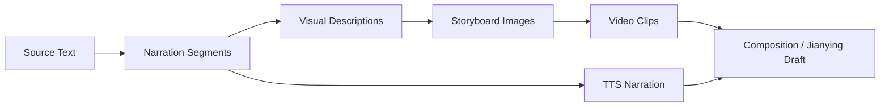
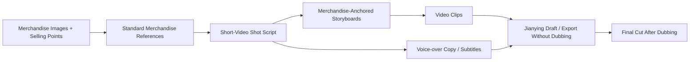

# Workflows and Modes {#workflows}

ArcReel supports multiple content sources and video generation methods. This page helps you choose the right path before starting a project and define the review criteria for each stage.

## 1. Two Dimensions to Choose Separately {#two-dimensions}

When creating a project, distinguish between:

1. **Content Mode**: determines how the script is organized;
2. **Generation mode**: determines whether video production is organized around storyboard images or reference images such as asset images. Storyboard to video can optionally generate images as multi-grid storyboards.

They can be combined. For example:

- Drama + Storyboard to video;
- Drama + Reference to video;
- Narration/Commentary + Storyboard to video;
- Ad / Short Video + Reference to video.

## 2. Content Sources {#content-sources}

### 2.1 Novel {#source-novel}

Best for:

- Novel adaptations;
- Novel-recap videos;
- Projects that need AI assistance with episode planning and structured scripts.

ArcReel will process:

- Characters and aliases;
- Key scenes;
- Key props;
- Plot stages;
- Episode boundaries;
- Shot-oriented descriptions.

Recommendations:

- Do not upload an entire long novel for your first attempt;
- Start with a self-contained chapter to validate the style and providers;
- Confirm character assets before expanding the production scope.

### 2.2 Finished Screenplay {#source-screenplay}

Best for projects that:

- Already have dialogue, voice-over, and scene directions;
- Need to preserve the author's original text as closely as possible;
- Only need asset design, storyboarding, and media generation.

Core principles:

- Dialogue and voice-over should be preserved verbatim whenever possible;
- Characters should be based on the author's character list and screenplay content;
- Extras and establishing shots should not automatically expand into long-lived character assets;
- The focus is normalization and shot production, not rewriting.

### 2.3 Merchandise Materials {#source-product-material}

Best for:

- Shoppable short videos;
- Merchandise demos;
- Ad scripts;
- Branded short videos.

Prepare:

- Front, side, detail, and in-use merchandise images;
- Core selling points;
- Target audience;
- Prohibited claims;
- Brand visual requirements;
- Target duration and publishing platform.

Ad / Short Video projects should establish stable merchandise asset images before generating shots in context.

## 3. Content Modes {#content-modes}

### 3.1 Narration/Commentary {#narration-mode}

#### Characteristics {#narration-traits}

- Narration is the primary vehicle for information;
- Visuals support the narrative and atmosphere;
- Content is split by reading rhythm and semantic pauses;
- Better suited to fast-paced vertical short videos.

#### Recommended Workflow {#narration-flow}

#### Review Focus {#narration-review}

- Whether each narration segment is too long;
- Whether each visual conveys one clear point;
- Whether the visuals merely restate the narration mechanically;
- TTS pronunciation of proper nouns and character names;
- Whether the narration and visuals have matching durations.

#### Best For {#narration-fit}

- Novel-recap videos;
- History, storytelling, and educational content;
- Narration-led merchandise introductions;
- Projects with limited lip-sync requirements.

### 3.2 Drama {#drama-mode}

#### Characteristics {#drama-traits}

- Scenes, characters, dialogue, and action form the primary structure;
- Greater emphasis on character consistency and shot continuity;
- Suitable for AI motion comics, narrative shorts, and animated adaptations of finished screenplays.

#### Recommended Workflow {#drama-flow}

#### Review Focus {#drama-review}

- Whether each episode has a complete objective and emotional arc;
- Whether character appearances and costumes remain continuous;
- Whether spatial relationships between shots remain stable;
- Whether dialogue, actions, and shot duration align;
- Whether eyelines and movement direction remain continuous across adjacent shots.

#### Best For {#drama-fit}

- Novel adaptations;
- Serialized AI motion comics;
- Character-driven narrative shorts;
- Animating existing dialogue-based screenplays.

### 3.3 Ad / Short Video {#ad-mode}

#### Characteristics {#ad-traits}

- A clearly defined target duration;
- Shots organized around selling points, use cases, and calls to action;
- Merchandise fidelity and reference consistency take priority;
- Can generate voice-over copy, subtitles, and a Jianying draft, with dubbing completed after export.

#### Recommended Workflow {#ad-flow}

#### Review Focus {#ad-review}

- Whether the merchandise's shape, Logo, colors, and structure are accurate;
- Whether selling points are factually supported;
- Whether shots rely too heavily on the generation model to fill in merchandise details;
- Whether the opening quickly communicates the merchandise's value;
- Whether the ending has a clear call to action;
- Whether voice-over copy and subtitles comply with platform rules.

## 4. Generation Modes {#video-production-routes}

### 4.1 Storyboard to Video {#storyboard-image-route}

Uses a single storyboard image as the video input.

#### Advantages {#storyboard-image-pros}

- The most straightforward workflow;
- Usually has the broadest provider support;
- Makes it easy to redo individual shots;
- Clearly separates storyboard review from video generation.

#### Limitations {#storyboard-image-cons}

- Primarily constrains the opening frame;
- The model may change characters and details during motion;
- The final frame may not transition well into the next shot.

#### Recommended For {#storyboard-image-fit}

- Most first-time projects;
- Projects with high-quality storyboards;
- Projects where each shot is relatively independent;
- Projects that need to switch providers quickly.

### 4.2 Multi-grid Storyboard Images in Storyboard to Video {#grid-storyboard-route}

Multi-grid storyboards are not a separate generation mode but an image-generation method within storyboard to video. It generates multiple shots from the same passage together on one or more multi-grid storyboards; after review, each grid is split into an individual storyboard image for each shot, and each video is then generated separately. The video model still receives the individual storyboard image after splitting.

Image generation takes two steps:

1. **Generate**: produces only the multi-grid storyboard itself and leaves each shot's existing storyboard image unchanged. Review it in **Multi-grid Storyboard Preview**; if you are not satisfied, regenerate it or upload your own composite image to replace it.
2. **Split into cells**: once you are satisfied, click **Split into cells** in **Multi-grid Storyboard Preview**, or agree in the conversation to let the Agent split it. Splitting overwrites every storyboard image the multi-grid storyboard covers for shots still in the script (shots since removed from the script are skipped); the previous storyboard images stay in the version history and can be rolled back.

Multi-grid storyboards automatically use square 2×2 / 3×3 grids based on the number of shots. Each cell uses the same aspect ratio as the project video; when there are more shots, they are divided across multiple multi-grid storyboards according to the grid capacity. Denser 4×4 / 5×5 grids are available only when the image model's resolution tier is configured as 4K—the more cells a multi-grid storyboard contains, the lower the resolution of each cell, and dense grids at lower resolution tiers will degrade downstream video quality.

Groups are set by chapter breaks: turn on **Set as chapter break** in the shot details, and a new group starts at that shot. Adding, removing, and reordering shots on the timeline, as well as chapter breaks, work the same way in grid projects.

After the grouping or the order within a group changes, the old multi-grid storyboard no longer matches the new group, so the group shows as not generated and needs to be regenerated. Storyboard images already split from a multi-grid storyboard are not affected and remain usable.

When a few shots in a group are missing storyboard images, you can generate them one by one from the shot details instead of regenerating the whole group.

#### Advantages {#grid-storyboard-pros}

- Characters, scenes, and visual style are easier to keep consistent within the same multi-grid storyboard;
- Lets you review the composition and rhythm of a group of consecutive shots at once;
- Suitable for establishing a unified visual direction before generating videos shot by shot.

#### Limitations {#grid-storyboard-cons}

- Multi-grid storyboard layouts and splitting rules add complexity;
- Each cell may be less sharp;
- Not available for reference to video or Ad / Short Video projects.

#### Recommended For {#grid-storyboard-fit}

- Consecutive shots that contain the same characters, scenes, or props;
- Projects where cross-shot consistency matters more than the freedom of an individual storyboard;
- Reviewing composition, costumes, and overall visual style in groups;
- Long-form projects that need to reduce visual drift between batches.

### 4.3 Reference to Video {#reference-video-route}

Instead of using an ordinary storyboard as the sole input, the workflow directly provides reference images such as asset images of characters, scenes, props, or merchandise.

#### Advantages {#reference-video-pros}

- Makes more direct use of long-lived assets;
- Suits video models that support multiple reference images;
- Can eliminate the ordinary storyboard generation step;
- Helps anchor character or merchandise identity.

#### Limitations {#reference-video-cons}

- Not supported by every provider;
- Reference image count, type, and weighting limits vary;
- Requires better prompts and asset selection;
- Composition may be less controllable without an explicit storyboard.

#### Recommended For {#reference-video-fit}

- Models with mature reference-to-video capabilities;
- High-quality character and merchandise assets;
- Projects where identity consistency is the priority;
- Projects that want fewer intermediate storyboard steps.

## 5. Mode Selection Table {#mode-selection-table}

| Requirement | Recommended Content Mode | Recommended Generation Mode |
|---|---|---|
| Novel recaps and narration-led content | Narration/Commentary | Storyboard to video |
| Continuous narratives and character dialogue | Drama | Storyboard to video (with multi-grid storyboards) or Reference to video |
| A complete existing screenplay | Drama | Storyboard to video |
| Merchandise structure must remain stable | Ad / Short Video | Prefer Reference to video |
| Strong cross-shot consistency requirements | Narration/Commentary or Drama | Storyboard to video (with multi-grid storyboards) |
| First ArcReel trial | Any | Storyboard to video |
| Limited provider support | Any | Storyboard to video |
| An established library of high-quality character assets | Drama | Reference to video |

## 6. Standard Production Stages {#production-stages}

Regardless of the selected mode, retain the following stages.

### Stage 1: Project Goals {#stage-project-goal}

Define:

- Publishing platform;
- Aspect ratio;
- Target duration;
- Audience;
- Visual style;
- Budget limit;
- Whether narration is needed;
- Whether further editing in Jianying is needed.

### Stage 2: Content Structure {#stage-content-structure}

Confirm:

- The sequence of plot points or selling points;
- Episode boundaries;
- The purpose of each shot;
- Characters, scenes, and props that first appear in each episode, and how the AI proposes to handle them;
- Content that must not be rewritten.

When the AI plans the script for each episode, it compares the characters, scenes, and props in the episode with the names, aliases, and descriptions of registered assets. Unregistered assets are listed in the **New assets in this episode** section of the content review page, each with the AI's proposed handling and reason: register as new asset, merge into existing asset, register as derivative, or do not register. You can change any item before confirming. When you confirm, these assets are registered together with the final script. Aliases on asset cards help the AI recognize other names for the same asset.

Before confirming, you can edit every field of each shot on the content review page, including duration, character / scene / prop references, the chapter break point, source text, lines, and speakers. Reference-to-video shots have no reference lists or chapter break points; asset references are written as `@[name]` in the shot text.

- Pick the duration from the tiers of the current video model. A duration outside the tiers is marked in red with the reason, and you must pick another one before confirming.
- References can use registered assets, and new assets in this episode whose handling is not **do not register**.
- Pick a speaker from registered characters and new characters in this episode, or type another name, such as an extra who has no bound voice.

If the references still contain a name that is neither registered nor a new asset registered in this episode, the confirmation is rejected and the affected shots and names are listed. Add, remove, and reorder shots on the timeline after confirming.

### Stage 3: Asset Images {#stage-reference-assets}

Confirm:

- Main characters;
- Recurring costumes;
- Scenes;
- Key props;
- Merchandise;
- Style references.

#### Merge assets registered twice {#merge-assets}

When the same person, place, or object is registered as two assets (for example, "Old Wang" and "Wang Jianguo"), open the menu on one of the asset cards, choose **Merge into…**, and pick the asset of the same type to keep. Only characters, scenes, and props can be merged.

After the merge, references in every episode's script plan, final script, drafts, and prompt text point to the kept asset, and the merged asset's name and aliases become aliases of the kept asset. Derivatives of a merged character move to the kept character; a derivative with the same name as one the kept character already has merges into the existing one. The kept asset's description, sheet, and other settings do not change.

For characters, you can also choose **Derivative**: the merged character becomes a derivative of the kept character, keeping its description, and the derivative sheet needs generating. Visual references point to that derivative, dialogue speakers change to the kept character, and the merged character's name is not recorded as an alias.

The merged asset's description, sheet and version history, voice settings, reference image, and reference audio are not kept, and a merge can't be undone. Before you confirm, the dialog lists, per episode, how many references will be rewritten and how many storyboard images and videos will become stale. It also shows the merged asset's description so you can copy what you need into the kept asset.

### Stage 4: Small Sample {#stage-sample-clips}

Start by producing:

- 1–2 characters;
- 2–4 storyboards;
- 1–2 video clips;
- A short narration segment.

Scale up batch production only after approving the sample.

### Stage 5: Batch Production {#stage-batch-production}

Before starting, confirm:

- Concurrency and RPM;
- Cost estimate;
- Provider quota;
- Failure retry strategy;
- Disk space.

#### Current, Stale, and Missing Artifacts {#artifact-currency}

ArcReel determines an artifact's state from the direct inputs used to generate it:

- **Current**: The formal artifact matches the current project, script, and selected version;
- **Stale**: The formal artifact still exists and can be previewed or exported, but a related input changed after it was generated;
- **Missing**: No usable formal artifact exists, so one must be generated;
- **Blocked**: A project reference or artifact record is damaged and must be repaired first. ArcReel will not treat it as missing and automatically pay to regenerate it.

By default, batch generation fills only missing items; both current and stale artifacts are preserved. After changing a prompt, character, narration, or another input, explicitly regenerate the affected shots if you want to refresh existing results. A same-named file in the project directory is not, by itself, a formal artifact. The project must retain either the artifact reference in its script or a verifiable version record.

### Stage 6: Quality Control and Export {#stage-qa-and-export}

Check:

- Character consistency;
- Scene continuity;
- Actions and eyelines;
- Narration synchronization;
- Subtitles;
- Clip order;
- Total duration;
- Final resolution;
- Whether the Jianying export can be opened.

## 7. Review Gates {#review-gates}

ArcReel's advantage is not “skipping review,” but placing review where the cost of rework is lower.

| Review Point | What to Do When It Fails | What Not to Do |
|---|---|---|
| Content review | Correct the episode plan, shot content, and handling of new assets | Continue generating all character images |
| Character assets | Redo the character design or description | Batch-generate storyboards with an incorrect character |
| Small storyboard sample | Correct composition and style | Generate the entire episode's videos immediately |
| Small video sample | Adjust the model, parameters, and action descriptions | Repeatedly test expensive models without a plan |
| Narration audition | Correct the voice, pace, and text | Generate every audio track at once |
| Final video preview | Adjust the order, duration, and transitions | Publish an unchecked version immediately |

## 8. Consistency Practices {#consistency-practices}

### Characters {#consistency-characters}

- Keep age, hairstyle, body type, and core costume descriptions fixed;
- Minimize unnecessary backgrounds in character assets;
- Give distinct identifying features to different main characters;
- Treat costume changes as explicit story states, not random prompt variations.

### Scenes {#consistency-scenes}

- Establish asset images for important scenes;
- Fix the spatial orientation and main decor;
- Avoid unnecessary changes in lighting and time of day within the same passage;
- Track where characters are positioned in the space.

### Props and Merchandise {#consistency-props}

- Create prop assets for story-critical items;
- Prefer real merchandise photos from multiple angles;
- Do not let the model invent important text, Logo details, or structures;
- When details drift, redo the affected shot first instead of concealing the problem with later shots.

## 9. Cost-Control Practices {#cost-control-practices}

- Start with low-cost samples, then move to high-quality batch production;
- Use high-quality models for character design and key cover images;
- Use more balanced models for ordinary storyboards;
- Confirm images before generating videos;
- Redo individual failed shots separately;
- Review the cost estimate before each batch;
- Do not submit an entire episode while the model configuration is uncertain;
- Save reusable character and scene assets.

## 10. Definition of Done {#definition-of-done}

An episode or short video is complete only when it meets at least the following conditions:

- The content structure has been confirmed;
- The main assets have been confirmed;
- Every shot has a clear purpose;
- Characters and merchandise have no obvious identity drift;
- Video clips transition cleanly;
- Narration and subtitles have been proofread;
- Actual costs have been reviewed;
- The final video or Jianying draft opens correctly;
- The project has been archived or backed up.
